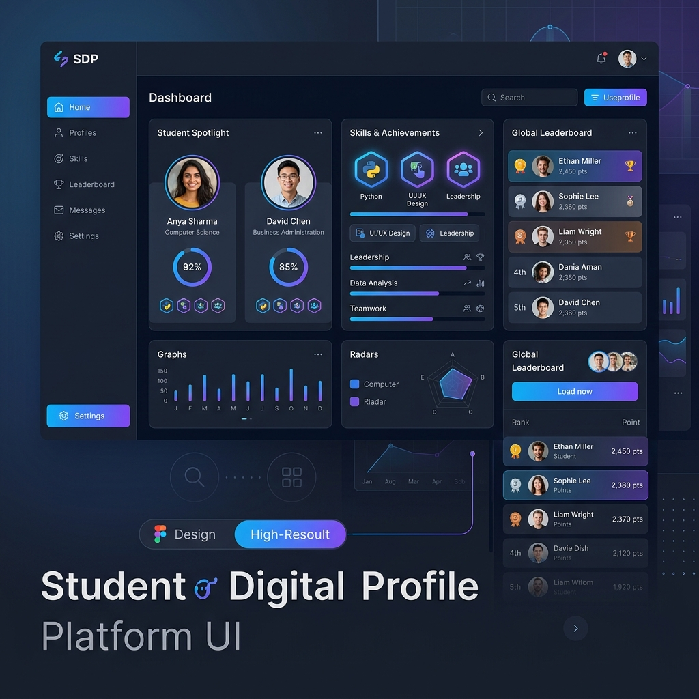

# 🎓 Student Digital Profile Platform

> A modern, full-stack application for students to showcase their skills, manage professional portfolios, and compete on a global leaderboard.



---

## 🚀 Overview

The **Student Digital Profile Platform** is designed to bridge the gap between students and opportunities. It provides a centralized hub where students can build comprehensive digital identities, showcase their best projects, and gain visibility through a gamified leaderboard system.

### Key Features
- **✨ Professional Profiles:** Custom digital portfolio pages with sections for skills, projects, education, and certificates.
- **🛡️ Secure Auth:** Seamless login experience using Supabase Authentication (Email & Google).
- **🏆 Gamified Leaderboard:** Real-time ranking based on student achievements and project complexity.
- **📱 Responsive Design:** Sleek, modern interface built with React and Tailwind CSS, optimized for all devices.
- **⚡ Fast Backend:** High-performance API powered by FastAPI and PostgreSQL (Supabase).
- **🖨️ Profile Sharing:** QR code generation and PDF downloads for easy sharing with recruiters (Coming Soon).

---

## 🛠️ Tech Stack

### Frontend
- **Framework:** React.js
- **Styling:** Tailwind CSS (Modern, Responsive Design)
- **State Management:** React Context API
- **Visuals:** Framer Motion for micro-animations

### Backend
- **Framework:** FastAPI (Python)
- **Database:** PostgreSQL via Supabase
- **Authentication:** Supabase Auth
- **Data Validation:** Pydantic

---

## ⚙️ Installation & Setup

For detailed instructions on how to set up the database, environment variables, and run the development servers, please refer to the **[Setup Guide (README_SETUP.md)](./README_SETUP.md)**.

### Quick Start
1. **Clone the repository:**
   ```bash
   git clone https://github.com/sragul2007123-ship-it/student-profile-platform.git
   ```
2. **Setup Backend:**
   ```bash
   cd backend
   pip install -r requirements.txt
   uvicorn main:app --reload
   ```
3. **Setup Frontend:**
   ```bash
   cd frontend
   npm install
   npm run dev
   ```

---

## 📜 License

Distributed under the MIT License. See `LICENSE` for more information.

---

## 📬 Contact

**Ragul S** - [GitHub Profile](https://github.com/sragul2007123-ship-it)

Project Link: [https://github.com/sragul2007123-ship-it/student-profile-platform](https://github.com/sragul2007123-ship-it/student-profile-platform)
